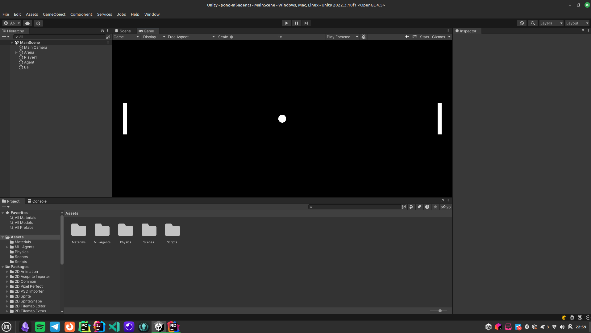

# pong-ml-agents

This is a simple implementation of the Pong game using the [Unity ML-Agents Toolkit](https://github.com/Unity-Technologies/ml-agents).
The goal is to train an agent to play Pong against another agent. And then, to play against the trained agent.
If you want to learn more about ML-Agents, you can check out this [ML-Agents tutorial by Code Monkey](https://www.youtube.com/watch?v=zPFU30tbyKs).



## Getting Started

For this project, you will need to install Unity and the ML-Agents Toolkit.

### Setting Up Your Development Environment

1. Install [Unity](https://unity.com/)
2. Install [Anaconda](https://www.anaconda.com/) (optional, you can use virtualenv instead, but make sure to use Python 3.8)
3. Clone this repo: `git clone https://github.com/marcaureln/pong-ml-agents.git`
4. Open the project in Unity

### Setting Up ML-Agents Toolkit

You can find detailed installation instructions [here](https://github.com/Unity-Technologies/ml-agents/blob/develop/docs/Installation.md).

1. Install the `com.unity.ml-agents` Unity package (in Unity, go to `Window > Package Manager` and search for `ml-agents`)
2. Install the `mlagents` Python package. you can do this by running the following commands in your terminal:

```bash
# Create a Conda environment with Python 3.8
conda create -n ml-agents python=3.8
# Activate environment
conda activate ml-agents
# Install mlagents Python package  
pip3 install mlagents==0.30.0
# If you are having issues with protobuf, try installing this version
pip3 install protobuf==3.20.3
```
